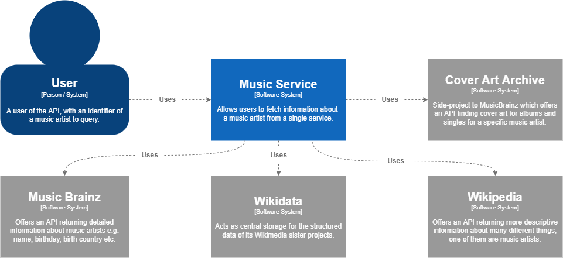
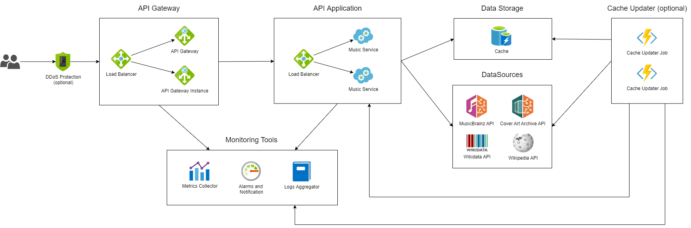

# Music Service

## Overview

## Last Review

| Date       | Author        | Description |
| ---------- | ------------- | --------------------------------------- |
| 13/08/2022 | Pedro Salomao | First revision of the Service Guidebook |

## Handbooks

Cross link any repo(s) README and Runbook(s)

## Context

Music Service is an aggregation API responsible to fetch information about a music artist from different sources and provide then in a single place.
Users will provide a MusicBrainz Identifier (MBID) which uniquely identifies a music artist, and the Service will use the following sources to fetch the needed information and return:

- MusicBrainz
- WikiData
- Wikipedia
- Cover Art Archive

## Functional Overview

Music Service is a simple software system with a single feature: aggregate and expose informations about Music Artists in a single API.
The data should be fetched from 4 different sources, MusicBrainz, Wikidata, Wikipedia, and Cover Art Archive, which should be the source of truth.
In the same way, it has only one type of actor, which is the user who queries the API.

### User Stories

1. As a user, I want to be able to fetch a music artist details using its MBID so I can use them in my own systems.

## Quality Attributes

### Core

- Availability: The system should be available to users 24x7, but a small amount of downtime (less than 30 minutes per day) can be tolerated.
- Interoperability: Interfaces both with the data sources should conform to and use existing data formats.
- Modifiability: Any external facing APIs should be versioned to allow for future modifications.
- Performance: APIs must respond to them in time, and the latency should be defined per API depending on what it does. See the session below for more details.
- Security: all APIs included in this service should be open to all users.
- Testability: Automated tests should be added to the service, in the form of both Unit Tests, Integration Tests, and Smoke Tests.

### Additional

- Portability: the system should be created and deployed in containers, so it is easy to port it to different platforms.
- Scalability: the system should support both horizontal scaling and vertical scaling.
- Deployability: deploys to production should only be made from a CI/CD pipeline.
- Monitorability: Metrics and logs should be collected and published to visualization systems in a way that they can be monitored and alerted upon, without the need to access production machines.

### APIs expected Performance

| API                        | Average Latency |
| -------------------------- | --------------- |
| Fetch Music Artist details | < 1 second      |

## Constraints

- Programming Language: Java, Kotlin, or Typescript.
- Required frameworks: Spring Boot
- Message Format: JSON
- Transport Protocols: HTTP and HTTPS.

## Principles

- Architectural layering strategy.
- No business logic in views.
- Use of interfaces.
- Dependency injection.
- High cohesion, low coupling.
- Prefer a rich domain model.
- Don’t reinvent the wheel.

## Software Architecture

### API Application

API Application is the main component of the Music Service, being responsible for providing the API which will return the information collected about a music artists. It should be accessible both externally to Users as well as internally to the Cache Updater.

#### View

The view will provide an interface to the Music Artist API, reading the input and formatting the output as to conform with the contract connected to the version of the API being queried.

#### Handler / Controller

The handler or controller will coordinate the API execution, connecting the different actors needed for the request to be processed, including data sources and models.

#### DataSource

The data source layer will be responsible for abstracting the connection with the underlying source, being it a database or an external service, in a way they are decoupled for the other layers such as models or controllers.

### Cache

The Cache should be an InMemory database such as Redis, temporarily holding the music artist information so the Music Service can expose them faster and more reliably regardless of the performance and availability of the external datasources. Retention should be 24 hours.

### Cache Updater (optional)

To avoid big latencies when users are querying Music Service, a background job will run warming up the cache by calling the API to fetch information and store it in the Cache.
The job should be executed regularly, with a interval of 5 minutes between executions.
It can use two different heuristics for cache updating: "Most requested music artists in the last 24 hours" and "Information being invalidated in the cache in the next hour".

## Infrastructure Architecture

### DDoS Protection (optional)

The first layer of contact with Music Service is a DDoS protection layer, which can be done by a Service such as Cloudflare, or can be incorporated in the API Gateway. The main goal is to protect the underlying services from attacks sush as Distributed Denial of Service.

### API Gateway

An API Gateway provides a unified entry point across different APIs and services, while he can also provide features such as Authentication, Authorization, Throttling, among others. Some of the possible solutions that could be used for this case include Kong, Tyk, and AWS API Gateway.

### API Application

Docker containers running the Music Service java application, with an orchestrator such as Kubernetes, Openshift, Hashicorp Nomad, etc.
This layer should support auto-scaling horizontally, starting new nodes and adding them to the Load Balancer if the load goes up.

### Cache

InMemory database caching the information fetched from the external datasources.
Redis to be used either installed and maintained manually or using a Manager Service such as AWS ElasticCache.

### Cache Updater

Docker containers running the Cache Updater java application, with an orchestrator such as Kubernetes, Openshift, Hashicorp Nomad, etc.

### Monitoring Tools

All services deployed in production should be monitored at all times, and engineers should be able to troubleshoot and inspect the service performance without the need to directly access Production instances.
For that, some monitoring tools are suggested such as:

- Metrics Collector: Collects metrics both from the infrastructure, but also from the application and stores them for further visualization. Examples of metrics collector infrastructure are: Prometheus, Graphite, and managed services such as AWS CloudWatch. For visualization, other tools are also available such as Grafana.
- Alarms and Notifications: To aid the OnCall engineers to monitor services and be notified when something is going wrong, it is good to have a system in place that can manage the process of alarm and notification. Solutions that can be use here include, but are not limited to, PagerDuty and Datadog.
- Logs Collector: As with any software systems, logs can be very important to troubleshoot problems. A Log Collector and visualization tool helps providing those logs to engineers without the need for them to log in production machines to fetch those logs. A good tool to use here is the ELK Stack, which is comprised by ElasticSearch, Logstash, and Kibana.

## Glossary

| Term | Description |
| ---- | ----------- |
| AWS | Amazon Web Services |
| MBID | MusicBrainz Identifier |